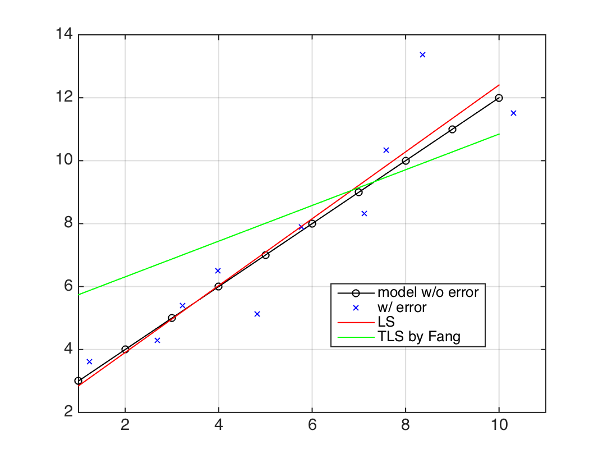
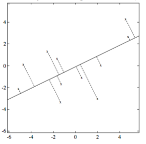

# EIV-Model

The method starts from this equation:
$$y = \left( {A - {E_A}} \right)\xi  + {e_y}$$

where $E_A$ is the n x m (unknown) random error matrix associated with $A$

For a linear fit of $z=ax+b$, a matrix $A$ will be built:
$$ A = \left[ {\begin{array}{*{20}{c}}
{{x_1}}&1\\
 \vdots & \vdots \\
{{x_m}}&1
\end{array}} \right] $$

and 
$$ \xi  = \left[ {\begin{array}{*{20}{c}}
a\\
b
\end{array}} \right] $$

It is straightforward to understand that the second column of $E_A$ should always be one, so only the first column is random. However, Fang's method does not has such a constraint, so I get wield result sometimes based on this method (the green line in figure below).

## Is iteration necessary?
Last time you told me that *the Total Least Squares problem is non-linear so it always involves iteration*. However, I find another literature (**ref-1**) avoild iteration by building objective function in a geometric perspective.
They try to find the line with the minimal sum of squares of distances from all observations (see equ-4.1).

Finally they got Equ-5.9, which could be solved by the SVD (singular value decomposition) method. They did not futherly explain how to do it by SVD, but you can find such details in section 4 in **ref-2**.

**ref-1**: An introduction to TLS
**ref-2**: Total least squares: state of the art regression in numerical analysis

