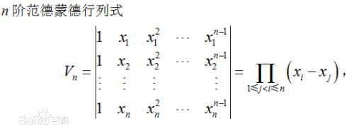
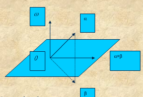
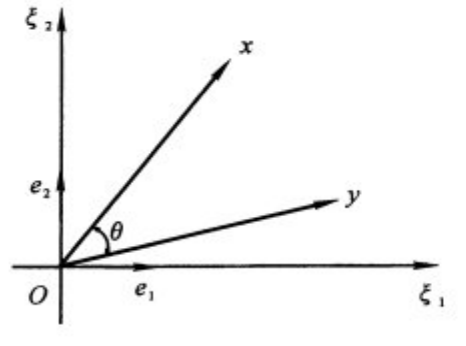

# 矩阵基本概念
## 定义
### 范德蒙行列式 verdermonde

矩阵形式在多项式拟合中会用到。等式右边表示n阶范德蒙行列式等于这个数的所有可能的差的乘积

## 变换
### Househoulder 变换
又称反射变换或镜像变换，有明显的几何意义
$$ H\left( \omega  \right)\alpha  = \beta $$
$$H\left( \omega  \right) = I - 2\omega {\omega ^T}$$
表示：将向量$\alpha$变成了以$\omega$为法向量的平面的对称向量$\beta$

### 旋转
使向量x顺时针旋转$\theta$角变为向量y。

$$ y = \left[ {\begin{array}{*{20}{c}}
{\cos \theta }&{\sin \theta }\\
{ - \sin \theta }&{\cos \theta }
\end{array}} \right]x = Tx $$

