# 模板

## 命令行：

```
gmt_surface.sh $data
gmt_surface.sh $data $ran $cran $dpi $title $cinfo
```
`ran`默认为`g`
`cran`默认为调用`grd2cpt`生成对称的cpt
`dpi`默认为1
`title`默认为数据文件名称
`cinfo`默认为无

## 投影和范围
### 设定
#### 全球
```bash
proj=Q180/40/$width # mid-longitude/equal altitude/length
ran=g    # world
```


#### 中国
```bash
proj=Q105/40/$width  # mid-longitude/equal altitude/length
ran=65/140/15/55     #china
```
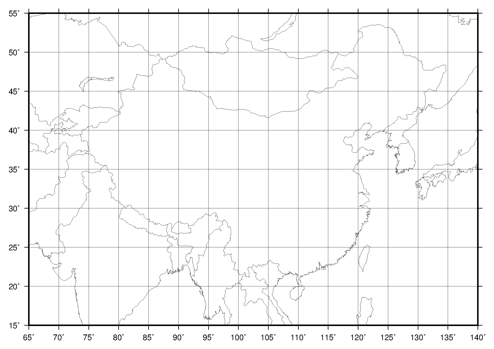

#### 青藏高原
```bash
ran=60/110/20/45       # tibet-L
proj="Q85/40/"$width # mid-longitude/equal altitude/length

ran=89/101/24/36    # NTM
proj=Q95/5/$width        #global, mid-longitude/equal altitude/length

```
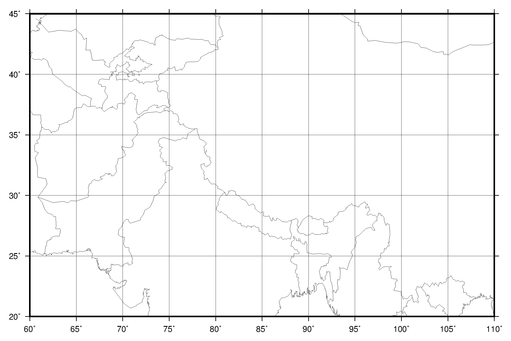

### 图解
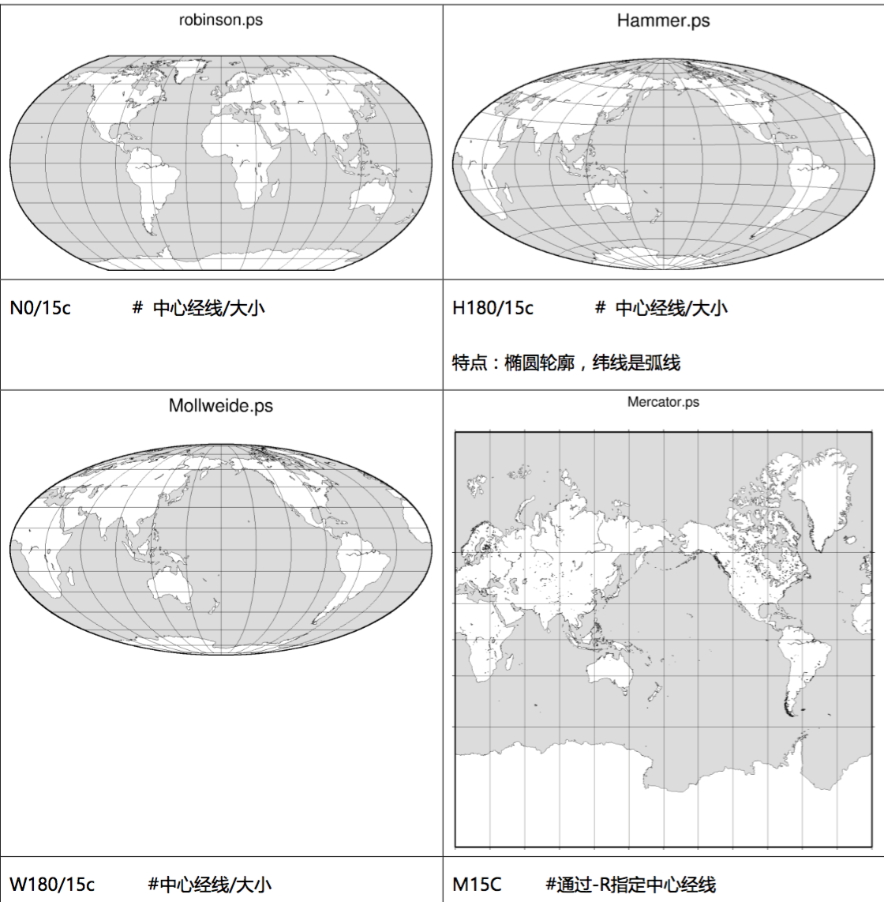
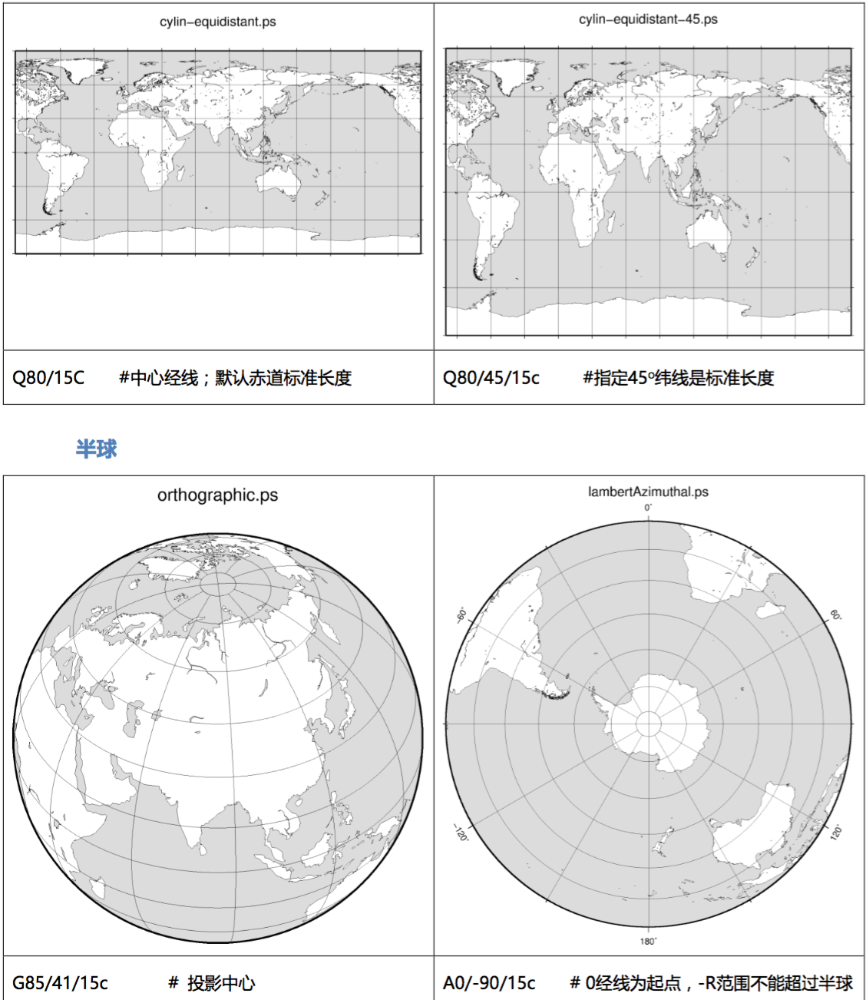
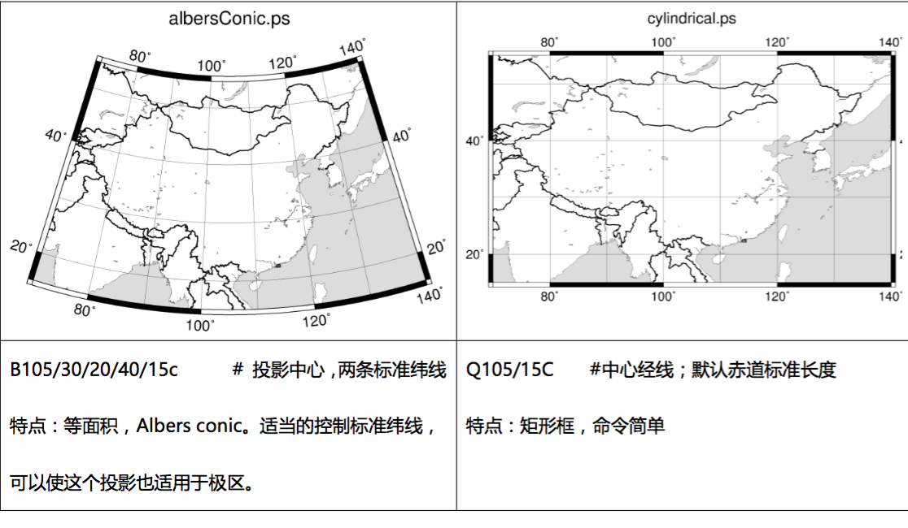

## 单图

```bash
# ---head {{
gmt set MAP_FRAME_TYPE=plain
gmt set FORMAT_GEO_MAP=+D # +D：0~360; -D：+-180
gmt set FONT_ANNOT_PRIMARY=12p,Helvetica,black
gmt set FONT_TITLE=12p,Helvetica,black
gmt set MAP_TITLE_OFFSET=0p
gmt set MAP_FRAME_AXES=WeSnZ
gmt set PS_MEDIA=A3
# ---head }}
# ---par {{
width=11; height=7.5; gap=2; # 2x2

dpi=0.1
ran=75/90/30/40
proj=Q83/5/$width        #global, mid-longitude/equal altitude/length
binfo=a5/a5::WSne
ps='fig.1.ps'

# --- data }}

function surf()  # {{
{
  #cinfo="1/:cm/yr:"
  data=$1; cran=$2; title=$3; cinfo=$4; ibar=$5
  title="${title//#/ }"

  gmt psxy -T -J -R -K -O $position >> $ps
  
  #echo "\n data=$data \n cran=$cran \n title=$title \n cinfo=$cinfo \n ran=$ran \n dpi=$dpi \n"

  cptfile='1.cpt'

  # grd {
  grd=$data"_"${ran//\//-}"_"$dpi".grd"
  if [ ! -f $grd ]; then
	gmt_dat2grd.sh $data $ran $dpi $grd
  else
	echo "$grd exists, not updated"
  fi
  # grd }

  gmt makecpt -T$cran -Cjet -Z -D> $cptfile
  bbinfo="${binfo}:.${title}:"
  #
  gmt grdimage $grd -C$cptfile -R${ran} -J${proj} -O -K >> $ps 
  #
  gmt pscoast -J$proj -R$ran -B"$bbinfo" -A10000 -W0.5p,black -N1 -K -O>> $ps
  # colorbar
  if [ $ibar -eq 1 ]; then # horizontal bar
	# D : gap/2, down, width, height
	x_shift=$( echo "scale=3;0"|bc ); y_shift=$( echo "scale=3;-$gap*0.8"|bc )
	gmt psscale -C$cptfile -B$cinfo -Dx$x_shift/$y_shift+w$width/0.5c+e+h  -O -K >> $ps
  elif [ $ibar -eq 2 ]; then # vertical bar
	# D : gap/2, down, width, height
	x_shift=$( echo "scale=3;$width+$gap/2"|bc ); y_shift=$( echo "scale=3;0"|bc )
	gmt psscale -C$cptfile -B$cinfo -Dx$x_shift/$y_shift+w$width/0.5c  -O -K >> $ps
  fi
} #}}

gmt psxy -T -J$proj -R$ran -K -X3c -Y3c  > $ps
#gmt psbasemap -Jx1c -R0/100/0/100 -Ba1g1 -K -O >> $ps

filename='data/result_trend.txt'
cran='-3/3/0.5'
title='(a)#Trend#of#GRACE#observation'
cinfo='1/:cm/yr:' #'1/:cm/yr:'
surf $filename $cran $title $cinfo 2

gmt psxy -T -J -R -O >> $ps
gmt psconvert -Tg -P $ps -A10p
open ${ps%ps}png #delete 'ps', add 'png'

```
## 画多图模板

采用for 循环，内有if语句可以设定不同的函数。**注意要补充fun函数部分**
设定nn和mm的值控制多图

```bash
# ---head {{
gmt set MAP_FRAME_TYPE=plain
gmt set FORMAT_GEO_MAP=+D # +D：0~360; -D：+-180
gmt set FONT_ANNOT_PRIMARY=12p,Helvetica,black
gmt set FONT_TITLE=12p,Helvetica,black
gmt set MAP_TITLE_OFFSET=0p
gmt set MAP_FRAME_AXES=WeSnZ
gmt set PS_MEDIA=A3
# ---head }}
# ---par {{
width=11; height=7.5; gap=2; # 2x2
# width=8; height=10; gap=2.1; # 2x3
nn=2; mm=2; nnmm=`echo $nn*$mm|bc` # the total plot

dpi=0.1
ran=89/101/24/36
proj=Q95/5/$width        #global, mid-longitude/equal altitude/length
binfo=a3/a3::WSne
ps='fig.2x3-2.ps'

cran1='-80/0/10'
cinfo1='10/:cm/yr:' #'1/:cm/yr:'
cran2='-2/2/0.2'
cinfo2='1/:cm/yr:' #'1/:cm/yr:'
# ---par }}

# --- data {{
ipdir='xxx/'

title[0]='(a)#Trend#of#GRACE#observation'
title[1]='(b)#Trend#of#mode#1'
title[2]='(c)#Trend#of#mode#2'
title[3]='(d)#Trend#of#modes#>#2'
title[4]='(e)#Recovered#glacier#mass'
title[5]='(f)#Recovered#glacier#signal'

filename=( 1 2 3 4 5 6 ) # filename in a list
# --- data }}

# --- fun {{

# --- fun }}

# --- template {{
x=$( echo "scale=3;$width+$gap" | bc )  # width+1*gap
y=$( echo "scale=3;$height+$gap" | bc )  # heigth+1*gap
x2=$( echo "scale=3;($width+$gap)*($mm-1)" | bc )  # width+1*gap
y2=$( echo "scale=3;($height+$gap)*($nn-1)" | bc )  # heigth+1*gap

p0="-X$x -Y0"
p1="-X0c -Y${y2}c" # shift of (1,1)
p2="-X-$x2 -Y-$y"  # shift of (x,1)
k=0
for i in `seq $nn`
do
  for j in `seq $mm`
  do
	if [ $j -eq 1 -a $i -eq 1 ] # shift of (1,1)
	then
	  position[$k]="$p1"
	elif test $j -eq 1         # shift of (x,1)
	then
	  position[$k]="$p2"
	else
	  position[$k]="$p0"
	fi

	k=`expr $k + 1`
  done
done

gmt psxy -T -J$proj -R$ran -K -X3c -Y3c  > $ps
#gmt psbasemap -Jx1c -R0/100/0/100 -Ba1g1 -K -O >> $ps
# --- template }}

# --- body {{
for ((i=0; i<nnmm; i++))
do
  file1=${ipdir}${filename[$i]}'.txt'
  if [ $i -ne 4 ]
  then
	surf $file1 $cran2 ${title[$i]} $cinfo2 "${position[$i]}" 1
  else
	surf2_points $file1 $cran1 ${title[$i]} $cinfo1 "${position[$i]}" 1
  fi
done
# --- body }}

gmt psxy -T -J -R -O >> $ps
gmt psconvert -Tg -P $ps -A10p
open ${ps%ps}png #delete 'ps', add 'png'
```


## 全球+极区
```bash
gmt set MAP_FRAME_TYPE=plain
ps=world-LE10-2.ps
input=./lonlat_global_LE10.txt
gmt pscoast -R-180/180/-60/70 -JQ0/45/18c -B60/30 -W -K -X2c -Y1c > $ps
gmt psxy $input -R -J -Sc0.05c -Wred -K -O >> $ps

gmt pscoast -R-180/180/60/90 -JA0/90/8c -B60 -W -K -O -Y11c >> $ps
gmt psxy $input -R -J -Sc0.1c -Wred -K -O >> $ps

gmt pscoast -R-180/180/-90/-60 -JA0/-90/8c -B60 -W -K -O -X10c >> $ps
gmt psxy $input -R -J -Sc0.1c -Wred -K -O >> $ps

gmt psxy -R -J -T -O >> $ps

gmt psconvert -Tg -P -A $ps

open ${ps%ps}png
```
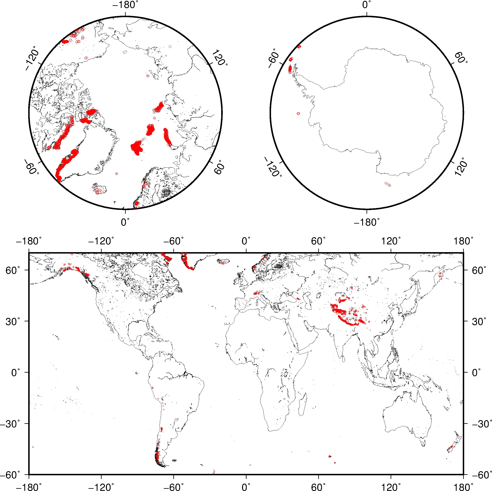


# Function
通用函数放在`/Users/Yish/workplace/projects/shellScript/GMT/`下

## 数据
##### gmt_dat2grd：格网数据插值

```
gmt_dat2grd.sh $dat $ran $dpi $grd

function dat2grd() # input: $dat, $ran, $dpi {{
{
  data=$1
  ran=$2
  dpi=$3
  grd=$4
  #grd=$data"_"${ran//\//-}"_"$dpi".grd"
  gmt blockmean $data -R${ran} -I${dpi} > 'tmp.xyz'
  gmt surface -R${ran} -I$dpi 'tmp.xyz' -G$grd
  rm tmp.xyz 
} #}}
```
### 地形

```bash
ip1='/Users/Yish/workplace/data/topo/global_0.1.grd'
ip2='/Users/Yish/workplace/data/topo/global_0.1_i.grd'
echo '-10000 200 10000 200' > pure-gray.cpt
gmt makecpt -C'pure-gray.cpt' -T-10000/10000/500 -D> tmp.cpt
gmt grdimage $ip1 -Ctmp.cpt -R${RAN} -J${proj} -I$ip2 -O -K >> $ps 
```
### 冰川
  
```bash
# glacier
  bd='/Users/Yish/workplace/mypaper/P_J3_east-tibet-glacier/glacier-position/SE.txt'
  glacier='/Users/Yish/workplace/data/glacier/WGI_glacier/0.xyz.tibet_glacier.txt'
  gmt psclip $bd -J -R -K -O >>$ps
  gmt psxy $glacier  -R -J -K -O -Sc0.03c -W0.1p,white -Gwhite >> $ps
  gmt psclip -C -J -R -K -O >> $ps
```
### 青藏高原边界
  
```bash
bd_tibet='/Users/Yish/workplace/data/map/tibet/TP_boundary.txt'
  gmt psxy $bd_tibet  -R -J -O -K -W0.5p,black,- -L >>$ps
```
### 雅江边界

```bash
  bd_basin='/Users/Yish/workplace/data/map/tibet/yaluzangbu.txt'
  bd_basin2='/Users/Yish/workplace/mypaper/P_J3_east-tibet-glacier/paper/fig1-background/data/Upper_Brahmaputra.txt'
  gmt psxy $bd_basin2  -R -J -O -K -W1.0p,255 -L >>$ps
  gmt psclip $bd_basin -J -R -K -O >> $ps
  color1='#12536b'
  gmt pscoast -J -R -I0/0.75p,$color1 -I1/0.75p,$color1  -I2/0.5p,$color1  -A10000 -Df -K -O>> $ps
  gmt psclip -C -J -R -K -O >> $ps

  gmt psxy $bd_basin2  -R -J -O -K -W0.5p,0 -L >>$ps

```

### 循环填充颜色

```bash
colors=( '#ffaca1' '#ffddb3' '#d4bb9c' '#e4fabb' '#c6ffdc' '#89c1b8' )

dataDir='BD-plot/'
ii=0

#    1       5        10        15        20        25         
ij=( 0 1 2 5 4 0 0 3 2 3 4 3 0 4 2 4 2 3 5 1 0 3 4 1 3 1 2)

while read f
do
  #echo "psxy  ${dataDir}$f -R -J -L -G#ffaca1 -Wthin,blue -O -K >> $ps"
  gmt psxy  ${dataDir}$f -R -J -L -G${colors[${ij[$ii]}]}@50 -O -K >> $ps
  ((ii++))
done < $dataDir'bd.list'
```
设定一组颜色，然后赋值给不同的填充
## 测试
##### 二维图数据
data='/Users/Yish/workplace/projects/shellScript/GMT/test/geoid_180.dat'
##### gmt_empty: 空图
```
gmt_empty.sh $position $ps
```
##### gmt_plotone: 简单图-海岸线
```
gmt_plotone.sh $position $proj $ran $ps
```

## 二维图
##### surf：二维图，带colorbar，makecpt
**调用**

```bash
position=""

data='/Users/Yish/workplace/projects/shellScript/GMT/test/geoid_180.dat'
cran='0'
title='plot#of#data'
cinfo='20/:m:' #'1/:cm/yr:'
surf $data $cran $title $cinfo "$position" $ibar
```
cran设定0，则调用grd2cpt生成对称cpt。

**代码：**

```bash
function surf()  # {{
#surf $data $cran $title $cinfo "$position" $ibar
{
  #cinfo="1/:cm/yr:"
  data=$1; cran=$2; title=$3; cinfo=$4; position=$5; ibar=$6
  title="${title//#/ }"

  gmt psxy -T -J -R -K -O $position >> $ps
  
  if [ ${#dpi} -eq 0 ]; then
	echo "dpi is not set, default value is 1"
	dpi=1
  fi

  echo "\n data=$data \n cran=$cran \n title=$title \n cinfo=$cinfo \n ran=$ran \n dpi=$dpi \n"

  cptfile='1.cpt'

  # grd {
  grd=$data"_"${ran//\//-}"_"$dpi".grd"
  if [ ! -f $grd ]; then
	gmt_dat2grd.sh $data $ran $dpi $grd
  else
	echo "$grd exists, not updated"
  fi
  # grd }

  if [ ${#cran} -gt 4 ]; then
	gmt makecpt -T$cran -Cjet -Z -D> $cptfile
  else
	gmt grd2cpt $grd -T= -Cjet -Z > $cptfile
	#-T: - for R =|zmin|, + for R = |zmax|, _ for R = min(|zmin|, |zmax|), or = for R = max(|zmin|, |zmax|)
  fi
  bbinfo="${binfo}:.${title}:"
  #
  gmt grdimage $grd -C$cptfile -R${ran} -J${proj} -O -K >> $ps 
  #   gmt grdcontour $grd -C0.5 -A1+g220 -Gn1 -R -J -K -O >> $ps
  #
  gmt pscoast -J$proj -R$ran -B"$bbinfo" -A10000 -W0.5p,black -N1 -K -O>> $ps
  # colorbar
  if [ $ibar -eq 1 ]; then # horizontal bar
	# D : gap/2, down, width, height
	x_shift=$( echo "scale=3;0"|bc ); y_shift=$( echo "scale=3;-$gap*0.8"|bc )
	gmt psscale -C$cptfile -B$cinfo -Dx$x_shift/$y_shift+w$width/0.5c+e+h  -O -K >> $ps
  elif [ $ibar -eq 2 ]; then # vertical bar
	# D : gap/2, down, width, height
	x_shift=$( echo "scale=3;$width+$gap/2"|bc ); y_shift=$( echo "scale=3;0"|bc )
	gmt psscale -C$cptfile -B$cinfo -Dx$x_shift/$y_shift+w$width/0.5c  -O -K >> $ps
  fi
} #}}

```
##### mypoints: 彩色散点
```bash
function mypoints() # input: $position, $data, $cpt {{
{
  position=$1
  data=$2
  cptfile=$3
  cinfo=2/:cm/yr:
  cran=-5/5/1

  gmt makecpt -T$cran -Cjet -Z -D > $cpt
  gmt psxy -T -J$proj -R$ran -K -O $position >> $ps
  gmt psxy $data -R${ran} -J$proj -C$cptfile -Ss0.05c -K -O >> $ps  # points
  gmt pscoast -J$proj -R$ran -B$binfo -W -A10000 -K -O>> $ps
  # colorbar
  # D : gap/2, down, width, height
  x_shift=$( echo "scale=3;$width/2"|bc )
  y_shift=$( echo "scale=3;-$gap*1"|bc )
  gmt psscale -C$cptfile -B$cinfo -Dx0/$y_shift+w$width/0.5c+e+h  -O -K >> $ps
} #}}
```
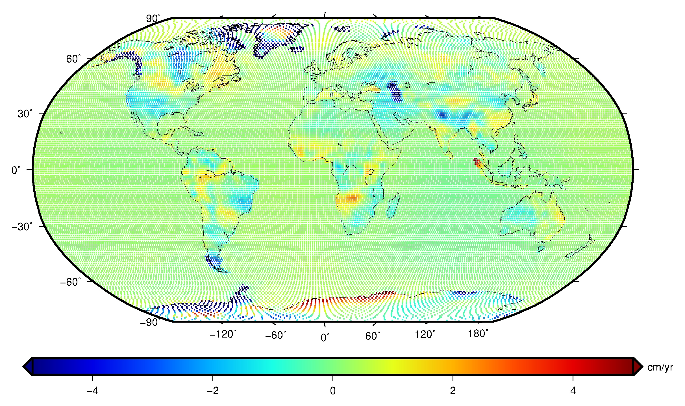

##### plotbasinMain: 填充流域
特点：psxy支持画随数值变化的彩色点，这里把这个点画的非常大，然后用psclip裁剪成流域的形状。这个优势是，如果直接用psxy填充这个流域，我们需要手动指定颜色，而这里是自动用psxy画点得到颜色。

```bash
function plotbasinMain() # position, ipfile, cptfile, barinfo, title{{
{
  position=$1
  ipfile=$2
  cptfile=$3
  barinfo=$4
  title=$5
  gmt psxy -T -J$proj -R$ran -K -O $position >> $ps
  gmt psxy -R$ran -J$proj -G200 -Sc20c -K -O >> $ps <<EOF
95 35  
EOF
  while read f
  do 
	xyz=`echo $f |cut -d ' ' -f 1,2,3`
	#echo $xyz
	fname=`echo $f |cut -d ' ' -f 4`
	ipbd='/Users/Yish/workplace/data/map/river-system/_new-20150831/basins/'$fname
	plotbasinOne "$xyz" $ipbd $cptfile
  done < $ipfile 

  gmt pscoast -J$proj -R$ran -B"$binfo:.$title:" -W -A10000 -N1 -K -O>> $ps
  # colorbar
  # D : gap/2, down, width, height
  x_shift=$( echo "scale=3;$width+$gap*0.2"|bc )
  len=$( echo "scale=3;$height*1"|bc )
  y_shift=$( echo "scale=3;$len/2"|bc )
  gmt psscale -C$cptfile -B$barinfo -D$x_shift/$y_shift/$len/0.5 -E -O -K >> $ps
}

function plotbasinOne() # input: $position, $data, $cpt
{
  xyz=$1
  ipbd=$2
  cptfile=$3

  #gmt psxy $ipbd -R$ran -J$proj -L -Wblack -K -O >> $ps   
  gmt psclip $ipbd -J$proj -R$ran -K -O >> $ps
  echo $xyz | gmt psxy -R$ran -J$proj -C$cptfile -Sc10c -Wblack -K -O >> $ps   
  gmt psclip -C -K -O >> $ps
} #}}
```

ipfile( 盆地中点经度，中点纬度，值，边界文件）:
```
  106.051    30.466     3.404 changjiang.txt
```

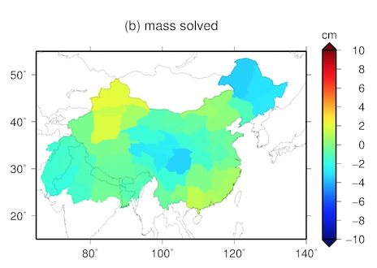

##### surfontopo: 彩色带地形

```bash
function surfontopo() # input: $position, $data, $cpt, $title --{{
{
  position=$1
  data=$2
  cptfile=$3
  title=''

  topo=/Users/Yish/workplace/data/topo/global_0.1.grd
  topo_i=/Users/Yish/workplace/data/topo/global_0.1_i.grd

  bbinfo="${binfo}:.${title}:"
  gmt psxy -T -J$proj -R$ran -K -O $position >> $ps
  #
  dat2grd $data $grd
  gmt grdview $topo -R${ran} -J${proj} -O -K -Qi150 -I$topo_i -G$grd -C$cptfile >> $ps 
}	#---}}
```
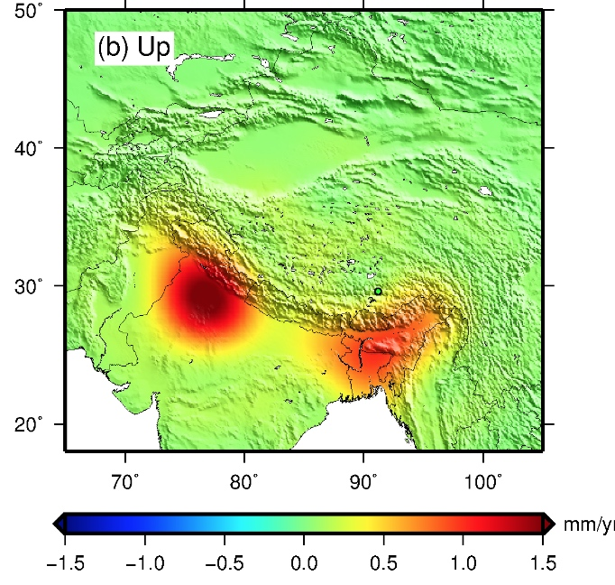

##### 灰色地形带散点

```bash
echo '-10000 150 10000 150'> 'pure-gray.cpt'
gmt makecpt -T-10000/10000/5000 -C'pure-gray.cpt' -D > $cpt_gray

function mypoints() # input: $position, $data, $cpt	!---{{
{
  position=$1
  data=$2
  cptfile=$3
  bcolor=$4

  topo=/Users/Yish/workplace/data/topo/global_0.1.grd
  topo_i=/Users/Yish/workplace/data/topo/global_0.1_i.grd
  
  gmt psxy -T -J$proj -R$ran -K -O $position >> $ps

  gmt grdimage $topo -R -J -O -K  -I$topo_i -C$cpt_gray >> $ps 
  gmt pscoast -J$proj -R$ran -B"$binfo" -W -N1 -Dh -Swhite -K -O>> $ps
  gmt psxy $data -R${ran} -J$proj -C$cptfile -Sc0.18c -Wgray -K -O >> $ps  # points

  gmt psscale -C$cptfile -B$bcolor -D3.8/-1/7.6/0.3h -E -O -K >> $ps
}	#---}}
```
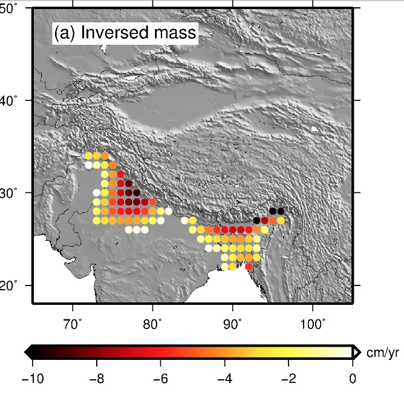

##### surf_phase, 相位图
注意：
原始数据范围0-360。
分辨率需和原始数据一致，否则0-360的跳跃会被插值。

```bash
function surf_phase() #{{
#surf_phase $data "$title" "$position" 1
{
  data=$1
  title=$2
  title="${title//#/ }"

  cran=0/360/30
  cinfo='g30f30'

  position=$3
  ibar=$4
  gmt psxy -T -J -R -K -O $position >> $ps
  echo "gmt psxy -T -J -R -K -O $position >> $ps"
  
  if [ ${#dpi} -eq 0 ]; then
	echo "dpi is not set, default value is 1"
	dpi=1
  fi

  echo ""
  echo "data=$data"
  echo "cran=$cran"
  echo "title=$title"
  echo "cinfo=$cinfo"
  echo "ran=$ran"
  echo "dpi=$dpi"
  echo "position=$position"
  echo ""

  cptfile='1.cpt'

  # grd {
  grd=$data"_"${ran//\//-}"_"$dpi".grd"
  if [ ! -f $grd ]; then
	gmt_dat2grd.sh $data $ran $dpi $grd
	#gmt xyz2grd $data -R$ran -I$dpi -G$grd
  else
	echo "$grd exists, not updated"
  fi
  # grd }

  if [ ${#cran} -gt 4 ]; then
	gmt makecpt -T$cran -Crainbow > $cptfile
	#echo 'no cpt make'
  else
	gmt grd2cpt $grd -T= -Cjet -Z > $cptfile
	#-T: - for R =|zmin|, + for R = |zmax|, _ for R = min(|zmin|, |zmax|), or = for R = max(|zmin|, |zmax|)
  fi
  bbinfo="${binfo}:.${title}:"
  #
  gmt grdimage $grd -C$cptfile -R${ran} -J${proj} -O -K >> $ps 
  #gmt grdcontour $grd -C60 -R -J -O -K -W0.5p,white>> $ps
  #gmt grdcontour $grd -C60 -R -J -O -K -W0.5p,black,->> $ps
  #
  gmt pscoast -J$proj -R$ran -B"$bbinfo" -A10000 -W0.5p,black -K -O>> $ps
  #gmt pscoast -J$proj -R$ran -B"$bbinfo" -A10000 -W0.5p,black -N1 -K -O>> $ps
  # colorbar
  if [ $ibar -eq 1 ]; then
	# D : gap/2, down, width, height
	x_shift=$( echo "scale=3;(-$gap-$width)/2*0"|bc )
	y_shift=$( echo "scale=3;-$gap*0.65"|bc )
	y_shift=-1.5
	gmt psscale -C$cptfile -N -B$cinfo -Dx$x_shift/$y_shift+w$width/0.4c+h  -O -K >> $ps
	# plot colorbar annotation
	str=( J F M A M J J A S O N D )
	for ((i=0;i<=11;i++)); 
	do 
	  x0=$(echo "scale=3; 1.0 * $width * ($i+0.5) / 12.0"|bc)
	  y0=$(echo "$y_shift-0.5"|bc)
	  echo "$x0 $y0 ${str[$i]}" | gmt pstext -F+jCM  -Jx1c -R0/100/0/100  -Gwhite -K -O -N >>$ps
	done
  fi
} #}}

```
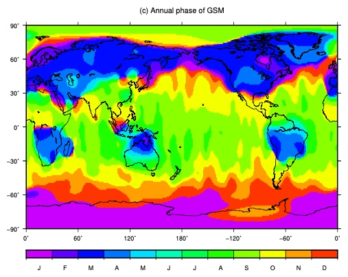

## 直角坐标系
##### plotxy, 普通曲线
```bash
ranxy=2002T/2017/-1/1
projxy=X$width/$height
function plotxy() # input: $position, $data {{
{
  position=$1
  data=$2
  binfo='a1g1:Year:/a0.2g0.2:unitless:WSne'
  #awk '{print $1, $2}' $data > tmp1
  gmt psxy -T -J$projxy -R$ranxy -K -O $position >> $ps
  gmt psxy $data -J -R -B -K -O -W1p,black >> $ps
  gmt psxy $data -J -R -B"$binfo" -Sc0.1c -W1p,black -K -O >> $ps
} #}}

```


## 标注

##### pstext
侧边栏：

```
gmt pstext -F+jBL+f16+a -Jx1c -R0/100/0/100 -K -O -N >> $ps << EOF
-1.2 1.5 90 T60+G300
-1.2 11.5 90 T60
-1.2 18.6 90 Water level change
EOF
```

title：
注意从最后一幅图中偏移回来。

```
gmt pstext -F+jBC+f14+a -Jx1c -R0/100/0/100 -X-${x3} -K -O -N >> $ps << EOF
0.5 23.2 0 (a)
8 23.2 0 (b)
15.3 23.2 0 (c)
22.7 23.2 0 (d)
EOF
```

