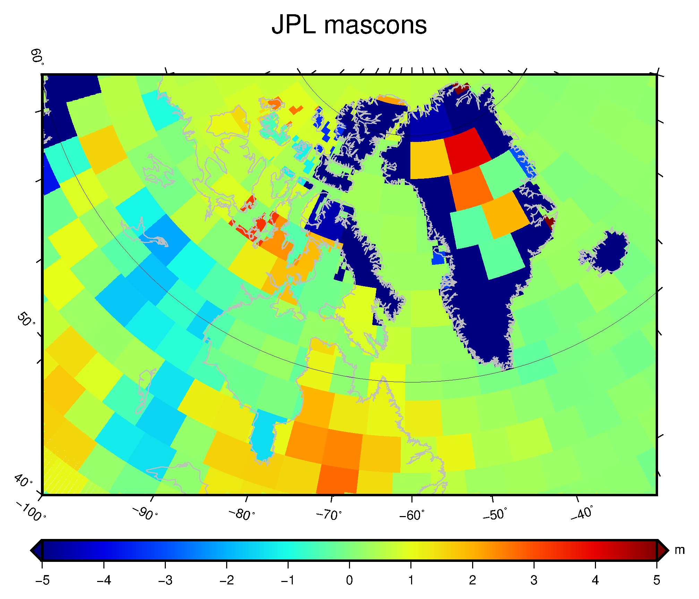
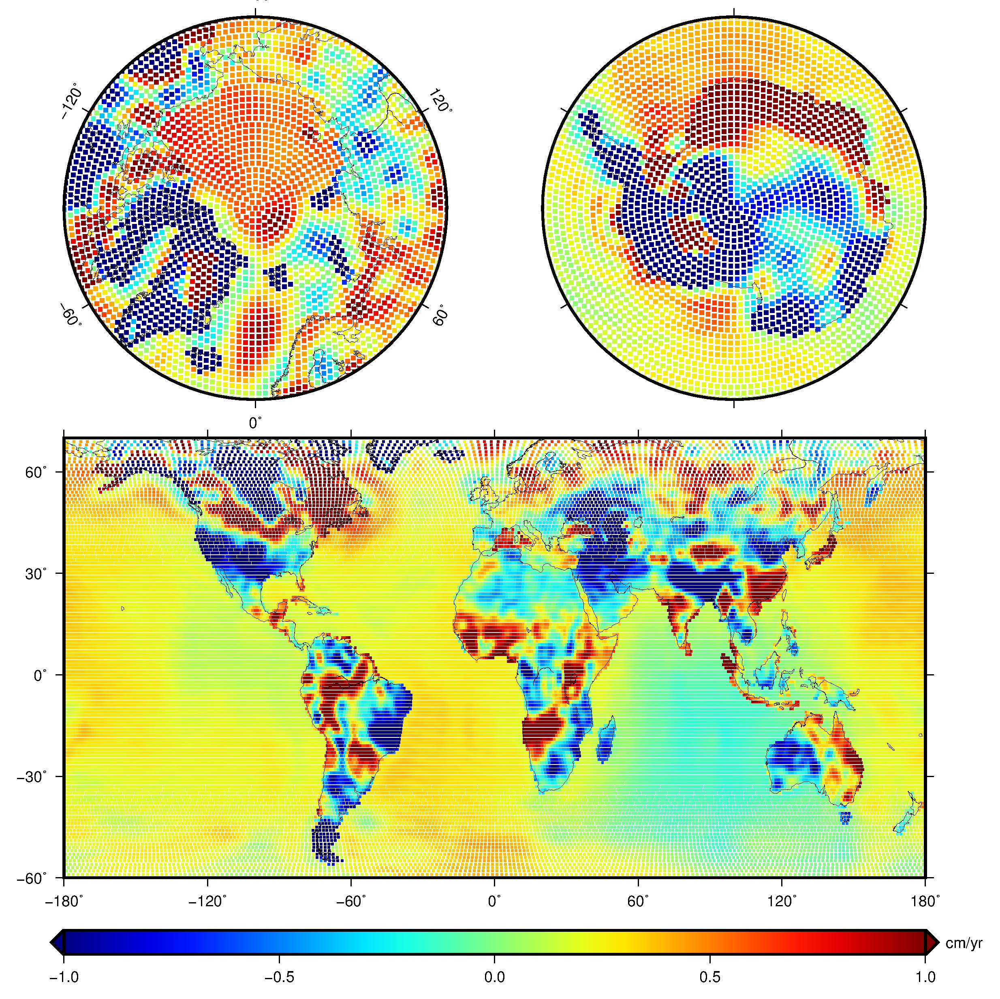

# 成果展示
## 1. 格陵兰岛附近斜投影


### 位置：

/Users/Yish/workplace/data/gravity/JPL-mascon/work/gmt

### 亮点：

1. 斜投影
2. 用psxy画旋转矩形（-Sj），输入文件有6列，需要matlab专门处理，前三列为xyz，第4~6列为：旋转角（经度减去投影垂直纬度线，即垂直时不旋转，这里是-60°），经度长（0.1，单位自动为cm，这里分辨率为0.5°，大一点也没关系，它们会依次覆盖），纬度长（0.15）

### 代码：

```sh
# ---set { 
gmt set MAP_FRAME_TYPE=plain
gmt set FONT_ANNOT_PRIMARY=9p,Helvetica,black
gmt set FONT_TITLE=18p,Helvetica,black
gmt set MAP_TITLE_OFFSET=10p
gmt set MAP_FRAME_AXES=WeSnZ
# ---set }

# --- fun {{
function plotxy() #surf $data $cran $title $cinfo "$position" {{
{
  data=$1
  cran=$2
  title=$3
  title="${title//#/ }"
  cinfo=$4  #cinfo="1/:cm/yr:"

  position=$5
  gmt psxy -T -J -R -K -O $position >> $ps

  echo ""
  echo "data=$data"
  echo "cran=$cran"
  echo "title=$title"
  echo "cinfo=$cinfo"
  echo ""

  cptfile='1.cpt'

  if [ ${#cran} -gt 4 ]; then
	gmt makecpt -T$cran -Cjet -Z -D> $cptfile
  else
	gmt grd2cpt $grd -T= -Cjet -Z > $cptfile
	#-T: - for R =|zmin|, + for R = |zmax|, _ for R = min(|zmin|, |zmax|), or = for R = max(|zmin|, |zmax|)
  fi
  bbinfo="${binfo}:.${title}:"
  #
  gmt psxy $data -C$cptfile -R -J -Sj -O -K >> $ps
  #gmt grdimage $grd -C$cptfile -R${ran} -J${proj} -O -K >> $ps 
  #
  gmt pscoast -J$proj -R$ran -B"$bbinfo" -A10000 -W0.5p,gray -K -O>> $ps
  # colorbar
  # D : gap/2, down, width, height
  x_shift=$( echo "scale=3;$width/2"|bc )
  y_shift=$( echo "scale=3;-$gap*1"|bc )
  gmt psscale -C$cptfile -B$cinfo -Dx0/$y_shift+w$width/0.5c+e+h  -O -K >> $ps
} #}}
# --- fun }}

ps=plot-1.ps

width=15
#proj="Q10/40/"$width
proj="B-60/70/60/80/"$width
gap=1.6
ran0=0/360/-90/90
ran=-100/40/20/70r
binfo="10/a10g20"
dpi=0.5

gmt psxy -T -J$proj -R$ran -K > $ps

# -- body {{
#data='/Users/Yish/workplace/projects/shellScript/GMT/test/geoid_180.dat'
data='trend_jpl_mascon_03-15_gmt.txt'
cran='-5/5/1'
title='JPL#mascons'
cinfo='1/:m:' #'1/:cm/yr:'
position="-X2c -Y2c"

plotxy $data $cran $title $cinfo "$position"

# -- body }}

gmt psxy -T -J -R -O >> $ps
gmt psconvert $ps -Tg -P -A10p
open ${ps%ps}'png'
#rm $grd
```

## 2.极区和全球分开画图，打点


### 位置
/Users/Yish/workplace/data/gravity/GSFC-mascon/shell_script
### 亮点
极区投影没有变形
### 代码
```sh
# ---set { 
gmt set MAP_FRAME_TYPE=plain
gmt set FONT_ANNOT_PRIMARY=9p,Helvetica,black
gmt set FONT_TITLE=18p,Helvetica,black
gmt set MAP_TITLE_OFFSET=10p
gmt set MAP_FRAME_AXES=WeSnZ
# ---set }

ps=plot-glaMask.ps

width=18
proj="Q10/40/"$width
proj="N10/"$width
gap=1.6
ran=0/360/-90/90
binfo="60/30"
dpi=1

gmt psxy -T -JX1c -R0/1/0/1 -K -Y3c > $ps

# -- body {{
data='../glacier_distribution/LLZ_mask_glacier_gsfc.txt'

cpt=1.cpt
cran=0/20/1
gmt makecpt -T$cran -Cjet> $cpt
cinfo='2'

gmt psxy -T -R-180/180/-60/70 -JQ0/45/18c -K -O >> $ps
gmt psxy $data -R -J -C$cpt -Ss0.07c -K -O >> $ps  # points
gmt pscoast -R -J -B60/30 -W0.5p -N1 -K -O -A10000 >> $ps

# colorbar {{
# D : gap/2, down, width, height
x_shift=$( echo "scale=3;$width/2"|bc )
y_shift=$( echo "scale=3;-$gap*1"|bc )
gmt psscale -C$cpt -B$cinfo -Dx0/$y_shift+w$width/0.5c+e+h  -O -K >> $ps
# colorbar }}

gmt psxy -T -R-180/180/60/90 -JA0/90/8c -K -O -Y10c >> $ps
gmt psxy $data -R -J -C$cpt -Ss0.13c -K -O >> $ps  # points
gmt pscoast -R -J -B60/15 -W0.5p -A10000 -K -O  >> $ps

#gmt psxy -T -R-180/180/60/90 -JA0/90/8c -K -O -X10c >> $ps
gmt psxy -T -R-180/180/-90/-60 -JA0/-90/8c -K -O -X10c >> $ps
gmt psxy $data -R -J -C$cpt -Ss0.13c -K -O >> $ps  # points
gmt pscoast -R -J -B60/30 -W0.5p -A10000 -K -O  >> $ps

# -- body }}

gmt psxy -T -J -R -O >> $ps
gmt psconvert $ps -Tg -P -A10p
open ${ps%ps}'png'
#rm $grd

```


