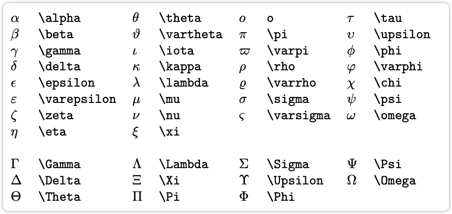
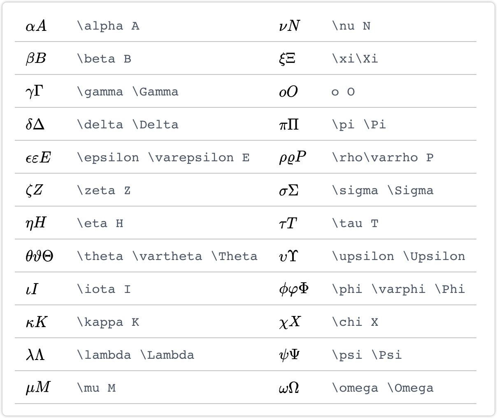

# 资源

[wiki](https://en.wikibooks.org/wiki/LaTeX)

[download](http://www.tug.org/mactex/mactex-download.html)

[10min-tutorial](https://learnxinyminutes.com/docs/latex/)

[详细一点的教程en](https://www.latex-tutorial.com/tutorials/)

# 常见数学公式

[简单参考](https://latex-tutorial.com/symbols/math-symbols/)

[详细参考](https://www.overleaf.com/learn/latex/List_of_Greek_letters_and_math_symbols)

[全部参考](https://www.rpi.edu/dept/arc/training/latex/LaTeX_symbols.pdf)

##  Functions

| $\sin x$            | $\log_a{x}$ |      |
| ------------------- | ----------- | ---- |
| $\sum$              | $\prod$     |      |
| $\lim_{x\to\infty}$ |             |      |
|                     |             |      |

## Integrals

$\int_a^b f(x)x$

$\iint f(x,y) dx dy$

## Matrices

矩阵表达：$ \boldsymbol{Y}$，$ \mathbf{Y} $，$\vec{Y}$

$\begin{matrix} 1&0 \\ 1&0 \end{matrix}$

$\begin{bmatrix} 1&0 \\ 1&0 \end{bmatrix}$

$\begin{pmatrix} 1&0 \\ 1&0 \end{pmatrix}$

$\begin{vmatrix} 1&0 \\ 1&0 \end{vmatrix}$
$$
\begin{bmatrix} 
1 & 0 & \cdots & 0 \\ 
1 & 0 & \cdots & 0 \\ 
\vdots & \vdots & \ddots & \vdots \\ 
1 & 0 & 0 & 0 
\end{bmatrix}
$$

$$
\alpha(x)=\left\{
                \begin{array}{ll}
                  x\\
                  \frac{1}{1+e^{-kx}}\\
                  \frac{e^x-e^{-x}}{e^x+e^{-x}}
                \end{array}
              \right.
$$

$$
X=
    \begin{cases}
      0, & \text{if}\ a=1 \\
      1, & \text{otherwise}
    \end{cases}
$$

## 空格

$$
\begin{align*}
f(x) &= x^2\! +3x\! +2 \\
f(x) &= x^2+3x+2 \\
f(x) &= x^2\, +3x\, +2 \\
f(x) &= x^2\: +3x\: +2 \\
f(x) &= x^2\; +3x\; +2 \\
f(x) &= x^2\ +3x\ +2 \\
f(x) &= x^2\quad +3x\quad +2 \\
f(x) &= x^2\qquad +3x\qquad +2
\end{align*}
$$

## other symbols

| $\leq \geq \simeq \approx \neq$                        | $\cdot \times \div \pm \mp$                  |
| ------------------------------------------------------ | -------------------------------------------- |
| $\sqrt{x}$                                             | $\sqrt[n]{x}$                                |
| $\frac{u(x)}{v(x)}$                                    | 另一种分数表示：$x+1\over y+1$               |
| $\alpha \beta \gamma $                                 | $\rho \sigma \delta \epsilon$                |
| $\subset \supset \subseteq \supseteq \in \notin \perp$ | $\otimes \oplus \cup \cap$                   |
| 正体：${\rm x}=a+3$                                    |                                              |
| $\nabla \partial \forall \infty$                       |                                              |
| $\overline{ab} \widetilde{xy} \overrightarrow{yz}$     | $\dot{a} \ddot{c} \bar{b} \tilde{x} \vec{y}$ |
| 文字：$a\quad \textrm{and} \quad b$                    |                                              |
|                                                        |                                              |

## cross reference (typora)

Here is a labeled equation: 
$$
x+1\over\sqrt{1-x^2} \label{refxx}
$$
This is a referece : $\ref{refxx}$

